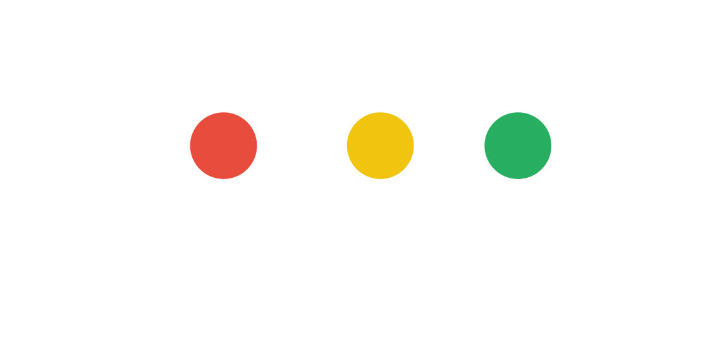

<h1 align="center">Hi, Rizwan here! </h1>

  

Connect with me:

  
  
  

<h3>I'm currently working on&nbsp;&nbsp;&nbsp;&nbsp;&nbsp;&nbsp;</h3>

 

You can opt for waitlist here: <a href="https://ridecarpe.com" > Carpe - Pakistan's Premium Carpooling Service</a>

 
### ⚙️ &nbsp;GitHub Analytics

  
  
  

